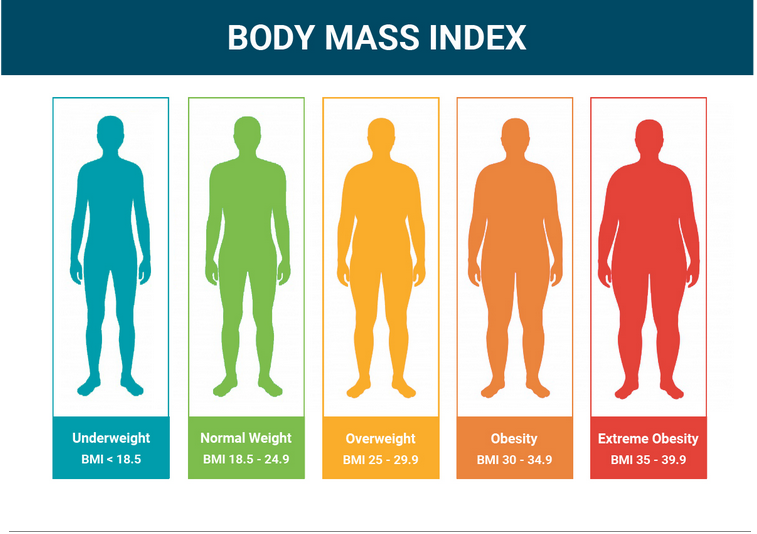

# Calculator

This Calculator has below features:

1.Summation\
2.Subtraction\
3.Multiplication\
4.Division\
5.Square root\
6.Factorial\
7.Sinus\
8.Cosine\
9.Tangent\
10.Cotangent

---

#Triangle rule

Check whether it is a triangle or not according to the following rule:

### "The sum of the length of the two sides of a triangle is greater than the length of the third side."

---

#Academic status of students

---

#BMI calculator

